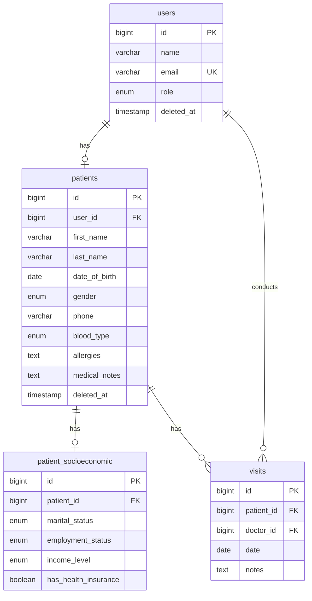
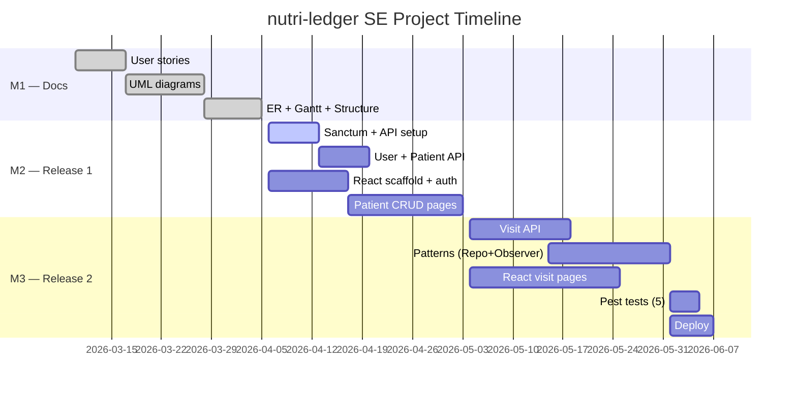

# M1 Tasks — Documentation Only
**Deadline:** Apr 5 2026
**Branch:** no code changes required
**Output directory:** `_docs/_shift/M1_deliverables/`

All deliverables are documents and diagrams. No backend or frontend code is written in this milestone.

---

## M1-01 — User Stories Document

**Goal:** Format all functional and non-functional user stories into a clean deliverable.

**Inputs:**
- `_docs/_shift/SE_MVP_PLAN.md` — stories 1-30 already drafted

**Output:**
- `_docs/SE_M1/user_stories.md` *(already exists at `_docs/_shift/M1_deliverables/01_user_stories.md`)*

**Instructions:**
1. Open `SE_MVP_PLAN.md` — the 27 functional stories + 3 non-functional stories are already written.
2. Copy them into a structured Markdown file under `_docs/_shift/M1_deliverables/01_user_stories.md`.
3. Group by feature group: Authentication & Roles / Patient Management / Visits & Encounters / Non-functional.
4. Format each story as: `US-XX | As a [role], I can [action] so that [benefit].`
5. Add a summary table at the top: ID, Role, Group, Priority (MoSCoW: M/S/C/W).

**Minimum count:** 25 functional + 3 non-functional = 28 total.

**Verification:** Count stories in the file. `grep -c "^| US-" user_stories.md` ≥ 28.

---

## M1-02 — Activity Diagrams × 5

**Goal:** Produce 5 PlantUML activity diagrams covering the main patient/visit flows.

**Inputs:**
- `_docs/_shift/DB_SCHEMA_FINAL.md` — entity structure
- `_docs/_shift/SE_MVP_PLAN.md` — diagram descriptions

**Output:**
- `_docs/_shift/M1_deliverables/diagrams/act_01_patient_registration.mmd` *(already exists)*
- Files for flows 2-5 *(already exist)*

**Required diagrams (already scaffolded — verify completeness):**
1. **Patient Registration Flow** — actor selects role (admin/doctor) → fills form → validation error path → patient + socioeconomic records created → success redirect
2. **Visit Creation Flow** — doctor selects patient → fills visit form (date, notes) → validation → visit saved → redirect to visit list
3. **Patient Profile View Flow** — user authenticated → role check branch (admin/doctor/patient) → patient loaded → fields rendered per role
4. **Patient Soft Delete & Restore Flow** — admin initiates delete → soft delete applied (deleted_at set) → restore path shown
5. **Visit List Access Flow** — role check → patient resolved → visits loaded or 403 returned

**Instructions:**
1. Open each `.mmd` file in `_docs/_shift/M1_deliverables/diagrams/`.
2. Verify each diagram has: start node, decision nodes (role/validation), happy path, error/rejection path, end node.
3. If any path is missing, add it.
4. Diagrams must be renderable with Mermaid or PlantUML — test with [mermaid.live](https://mermaid.live).

**Verification:** Paste each `.mmd` file into mermaid.live — no syntax errors, all branches visible.

---

## M1-03 — Sequence Diagrams × 5

**Goal:** Produce 5 PlantUML/Mermaid sequence diagrams for the main API request flows.

**Inputs:**
- `_docs/_shift/DB_SCHEMA_FINAL.md`
- `_docs/_shift/SE_MVP_PLAN.md` — diagram descriptions

**Output:**
- `_docs/_shift/M1_deliverables/diagrams/seq_01_*.mmd` through `seq_05_*.mmd` *(already exist)*

**Required diagrams (verify completeness):**
1. **POST /api/login** — Client → API → Sanctum validates credentials → 200 token OR 422 error
2. **POST /api/patients** — Client (admin/doctor) → API → auth:sanctum → PatientPolicy::create → PatientService::createPatient → DB insert → PatientResource → 201
3. **GET /api/patients/{id}** — Client → API → auth:sanctum → PatientPolicy::view (role check) → Patient loaded with socioeconomic → PatientResource → 200 OR 403
4. **PUT /api/patients/{id}** — Client → API → auth:sanctum → FormRequest validation → PatientPolicy::update → PatientService::updatePatient → PatientResource → 200
5. **POST /api/patients/{patient}/visits** — Client (doctor) → API → auth:sanctum → VisitPolicy::create → VisitService::createVisit → VisitResource → 201

**Instructions:**
1. Each diagram must show: Client, API (Laravel), Middleware/Policy, Service, Database, Response.
2. Show both success and rejection paths in each diagram.
3. Use participant labels: `Client`, `API`, `Policy`, `Service`, `Database`.

**Verification:** Paste each `.mmd` into mermaid.live — renders without errors.

---

## M1-04 — Class Diagram

**Goal:** UML class diagram for all 4 domain entities with relationships and cardinalities.

**Inputs:**
- `_docs/_shift/DB_SCHEMA_FINAL.md`
- `app/Models/User.php`, `Patient.php`, `PatientSocioeconomic.php`, `Visit.php`

**Output:**
- `_docs/_shift/M1_deliverables/diagrams/class_diagram.mmd` *(already exists — verify)*

**Required entities and fields:**

```
User
  - id: bigint
  - name: string
  - email: string
  - role: enum [admin, doktor, pacijent]
  - deleted_at: timestamp (nullable)
  + isAdmin(): bool
  + isDoctor(): bool
  + isPatient(): bool

Patient
  - id: bigint
  - user_id: bigint (FK)
  - first_name: string
  - last_name: string
  - date_of_birth: date
  - gender: enum [M, F]
  - phone: string
  - address: string (nullable)
  - blood_type: enum (nullable)
  - allergies: text (nullable)
  - medical_notes: text (nullable)
  - deleted_at: timestamp (nullable)
  + fullName(): string

PatientSocioeconomic
  - id: bigint
  - patient_id: bigint (FK)
  - marital_status: enum (nullable)
  - employment_status: enum (nullable)
  - income_level: enum (nullable)
  - has_health_insurance: boolean

Visit
  - id: bigint
  - patient_id: bigint (FK)
  - doctor_id: bigint (FK → User)
  - date: date
  - notes: text (nullable)
```

**Relationships:**
- `User "1" -- "0..1" Patient`
- `Patient "1" -- "0..1" PatientSocioeconomic`
- `Patient "1" -- "0..*" Visit`
- `User "1" -- "0..*" Visit : doctor_id`

**Verification:** Diagram renders and shows all 4 entities with FK arrows.

---

## M1-05 — ER Diagram

**Goal:** Textual ER diagram specification + visual diagram matching actual DB schema.

**Inputs:**
- `_docs/_shift/DB_SCHEMA_FINAL.md` — source of truth

**Output:**
- Add ER diagram section to class diagram file, OR create `_docs/_shift/M1_deliverables/diagrams/er_diagram.mmd`

**Instructions:**
1. The class diagram in M1-04 covers entities and FKs — the ER diagram adds column-level detail.
2. Create a Mermaid `erDiagram` block:



3. Reference `DB_SCHEMA_FINAL.md` for all column types and nullable flags.

**Verification:** Paste into mermaid.live — all 4 tables visible with FK links.

---

## M1-06 — Gantt Chart

**Goal:** Visual project timeline from SE_MVP_PLAN.md formatted as a Mermaid Gantt.

**Inputs:**
- `_docs/_shift/SE_MVP_PLAN.md` — Gantt table (M1/M2/M3 phases)
- `_docs/_shift/M1_deliverables/02_product_roadmap.md` *(already exists)*

**Output:**
- Add Gantt block to `_docs/_shift/M1_deliverables/02_product_roadmap.md` if not already present

**Mermaid Gantt template:**



**Verification:** Paste into mermaid.live — renders timeline with correct phases.

---

## M1-07 — Project Structure Document

**Goal:** Document the folder layout of both the BE repo and FE repo so the team knows where files live.

**Inputs:**
- Current project tree (`app/`, `routes/`, `resources/`)
- M2/M3 planned structure

**Output:**
- `_docs/_shift/M1_deliverables/project_structure.md` (new file)

**BE structure (post-pivot):**

```
nutri-ledger/                     ← Laravel API repo
├── app/
│   ├── Http/
│   │   ├── Controllers/
│   │   │   └── Api/
│   │   │       ├── AuthController.php
│   │   │       ├── UserController.php
│   │   │       ├── PatientController.php
│   │   │       └── VisitController.php
│   │   ├── Requests/
│   │   │   ├── StorePatientRequest.php
│   │   │   ├── UpdatePatientRequest.php
│   │   │   ├── StoreVisitRequest.php
│   │   │   └── UpdateVisitRequest.php
│   │   ├── Resources/
│   │   │   ├── UserResource.php
│   │   │   ├── PatientResource.php
│   │   │   ├── PatientSocioeconomicResource.php
│   │   │   └── VisitResource.php
│   │   └── Middleware/
│   │       └── RoleMiddleware.php
│   ├── Models/
│   │   ├── User.php
│   │   ├── Patient.php
│   │   ├── PatientSocioeconomic.php
│   │   └── Visit.php
│   ├── Policies/
│   │   ├── PatientPolicy.php
│   │   ├── VisitPolicy.php
│   │   └── UserPolicy.php
│   ├── Repositories/          ← M3
│   │   ├── UserRepository.php
│   │   ├── PatientRepository.php
│   │   └── VisitRepository.php
│   └── Services/
│       ├── UserService.php
│       ├── PatientService.php
│       └── VisitService.php
├── routes/
│   ├── api.php                ← new in M2
│   └── web.php
├── bootstrap/app.php
└── tests/Feature/Api/
    ├── AuthTest.php
    ├── PatientApiTest.php
    └── VisitApiTest.php
```

**FE structure (React SPA):**

```
frontend/                         ← React SPA (separate repo or /frontend subfolder)
├── src/
│   ├── api/
│   │   └── client.ts             ← axios instance with Bearer interceptor
│   ├── store/
│   │   └── authStore.ts          ← Zustand auth state
│   ├── router/
│   │   └── index.tsx             ← React Router v6 routes + ProtectedRoute
│   ├── pages/
│   │   ├── auth/
│   │   │   └── LoginPage.tsx
│   │   ├── patients/
│   │   │   ├── PatientListPage.tsx
│   │   │   ├── PatientCreatePage.tsx
│   │   │   ├── PatientViewPage.tsx
│   │   │   └── PatientEditPage.tsx
│   │   └── visits/               ← M3
│   │       ├── VisitListPage.tsx
│   │       ├── VisitCreatePage.tsx
│   │       └── VisitViewPage.tsx
│   └── main.tsx
├── package.json
├── vite.config.ts
└── tsconfig.json
```

**Verification:** Read through both trees and confirm all files listed exist in the codebase or are explicitly planned for M2/M3.
